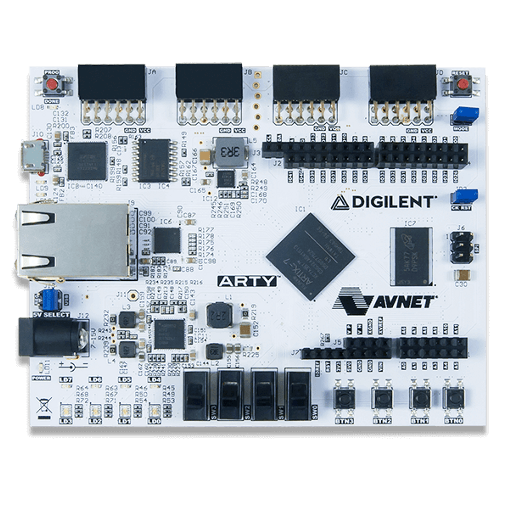
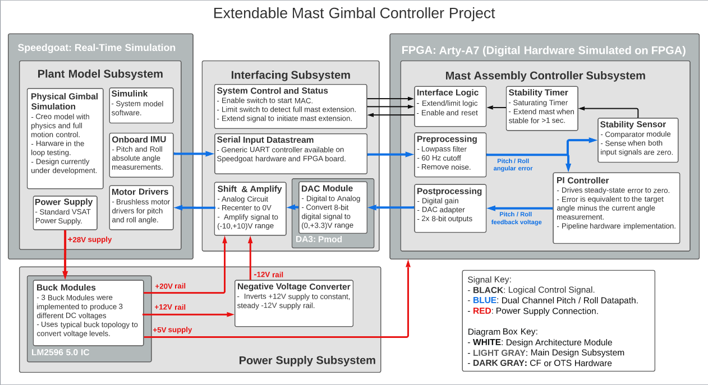

# NASA(LaRC)/SSAI Extendable Mast Gimbal PI Controller 

[-yellow)](https://www.xilinx.com/support/download.html)

This repository stores a Xilinx Vivado Project file which describes the hardware model of a PI controller meant to control the leveling and deployment of a VSAT (Vertical Solar Array Technology) remote power collecter.

## Synthesis Hardware

The FPGA being used to host the hardware model of the PI controller is the Arty A7: Artix-7 development board, should this design need to be deployed elsewhere, an FPGA which is space graded should be used.

## High Level Hardware Design

